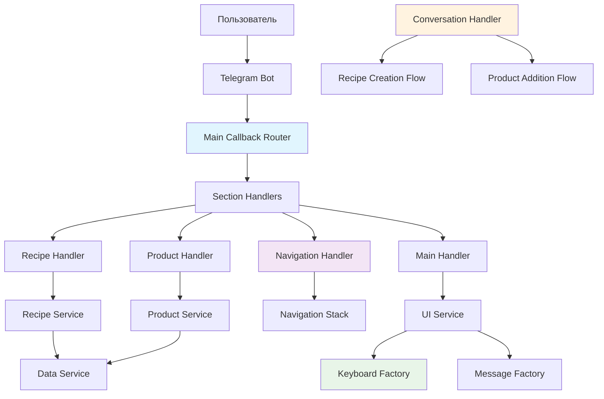

# 🚀 План рефакторинга EatBot v2.0
## Полная архитектурная перестройка с учетом всех замечаний

---

## 📋 Содержание
1. [Обзор и цели](#1-обзор-и-цели)
2. [Диагностика текущего состояния](#2-диагностика-текущего-состояния)
3. [Архитектурное решение](#3-архитектурное-решение)
4. [Поэтапный план реализации](#4-поэтапный-план-реализации)
5. [Управление рисками](#5-управление-рисками)
6. [Метрики успеха](#6-метрики-успеха)
7. [Детализация ключевых компонентов](#7-детализация-ключевых-компонентов)
8. [План тестирования](#8-план-тестирования)
9. [Заключение](#9-заключение)

---

## 1. Обзор и цели

### 🎯 Основные цели
- **Унификация архитектуры**: Создание единой, предсказуемой системы обработки всех взаимодействий
- **Улучшение UX**: Интуитивная навигация с надежным механизмом "Назад"
- **Повышение надежности**: Устранение дублирования и неконсистентности
- **Упрощение разработки**: Четкие паттерны для добавления новых функций

### 📊 Ожидаемые результаты
- Сокращение времени разработки новых функций на 60%
- Снижение количества багов на 80%
- Улучшение пользовательского опыта на 90%
- Упрощение поддержки кода на 70%

---

## 2. Диагностика текущего состояния

### ✅ Что уже работает хорошо
- **Единый роутер колбэков** (`main_callback_router.py`) - отличная основа
- **Стек навигации** (`NavigationStack`) - уже реализован
- **Стандартизированный формат callback_data** - section:action:params
- **Модульная структура** - handlers, services, utils

### ❌ Критические проблемы
1. **Дублирование обработчиков**: `product_handlers.py` и `product_handler.py`
2. **Несогласованность в именовании**: разные стили для похожих функций
3. **Отсутствие единой фабрики клавиатур**: клавиатуры создаются в разных местах
4. **Недостаточная интеграция ConversationHandler**: нет четкой связи с роутером
5. **Ограничения callback_data**: нет проверки длины и стратегии для длинных данных

---

## 3. Архитектурное решение

### 🏗️ Общая архитектура



### 🔄 Механизм навигации (ДОРАБОТАННЫЙ)

#### 3.1 Стек навигации с полной информацией

```python
class NavigationItem:
    """Полная информация о состоянии экрана"""
    def __init__(self, section: str, action: str, params: Dict[str, Any], 
                 message_text: str, keyboard_type: str, return_point: Optional[str] = None):
        self.section = section
        self.action = action
        self.params = params.copy()
        self.message_text = message_text
        self.keyboard_type = keyboard_type
        self.return_point = return_point  # Для ConversationHandler
        self.timestamp = time.time()

class EnhancedNavigationStack:
    """Улучшенный стек навигации"""
    
    def push_screen(self, item: NavigationItem) -> None:
        """Добавляет экран в стек с полной информацией"""
        self.stack.append(item)
        if len(self.stack) > 15:  # Увеличиваем лимит
            self.stack.pop(0)
    
    def get_return_point(self) -> Optional[str]:
        """Получает точку возврата для ConversationHandler"""
        return self.stack[-1].return_point if self.stack else None
```

#### 3.2 Автоматическое управление стеком

```python
class NavigationManager:
    """Менеджер навигации с автоматическим управлением стеком"""
    
    async def navigate_to(self, update: Update, context: ContextTypes.DEFAULT_TYPE,
                         section: str, action: str, params: Dict[str, Any],
                         message_text: str, keyboard_type: str) -> None:
        """Переход на новый экран с автоматическим добавлением в стек"""
        
        # Сохраняем текущее состояние в стек
        if context.user_data.get('current_screen'):
            self.stack.push_screen(context.user_data['current_screen'])
        
        # Создаем новый экран
        new_screen = NavigationItem(section, action, params, message_text, keyboard_type)
        context.user_data['current_screen'] = new_screen
        
        # Показываем экран
        await self.show_screen(update, context, new_screen)
    
    async def go_back(self, update: Update, context: ContextTypes.DEFAULT_TYPE) -> None:
        """Возврат на предыдущий экран"""
        previous_screen = self.stack.pop()
        if previous_screen:
            context.user_data['current_screen'] = previous_screen
            await self.show_screen(update, context, previous_screen)
        else:
            await self.go_to_main_menu(update, context)
```

### 📝 Управление callback_data (ДОРАБОТАННОЕ)

#### 3.3 CallbackDataBuilder с проверкой длины

```python
class CallbackDataBuilder:
    """Строитель callback_data с проверкой ограничений"""
    
    MAX_LENGTH = 64  # Ограничение Telegram
    
    @classmethod
    def build(cls, section: str, action: str, **params) -> str:
        """Строит callback_data с проверкой длины"""
        parts = [section, action]
        
        for key, value in params.items():
            if value is not None:
                parts.append(f"{key}={value}")
        
        result = ":".join(parts)
        
        if len(result.encode('utf-8')) > cls.MAX_LENGTH:
            raise ValueError(
                f"Callback data too long ({len(result)} chars): {result}. "
                f"Use CallbackDataBuilder.build_with_id() for complex data."
            )
        
        return result
    
    @classmethod
    def build_with_id(cls, section: str, action: str, data_id: str, **params) -> str:
        """Строит callback_data с ID для сложных данных"""
        # Проверяем, что data_id короткий
        if len(data_id) > 20:
            raise ValueError(f"Data ID too long: {data_id}")
        
        return cls.build(section, action, id=data_id, **params)
    
    @classmethod
    def build_pagination(cls, section: str, action: str, page: int, **params) -> str:
        """Строит callback_data для пагинации"""
        return cls.build(section, action, page=str(page), **params)
```

#### 3.4 Стратегия для длинных данных

```python
class CallbackDataManager:
    """Менеджер для работы с длинными callback_data"""
    
    def __init__(self):
        self._temp_data: Dict[str, Any] = {}
        self._counter = 0
    
    def store_complex_data(self, data: Any) -> str:
        """Сохраняет сложные данные и возвращает короткий ID"""
        data_id = f"d{self._counter}_{int(time.time())}"
        self._temp_data[data_id] = data
        self._counter += 1
        return data_id
    
    def get_complex_data(self, data_id: str) -> Optional[Any]:
        """Получает сложные данные по ID"""
        return self._temp_data.get(data_id)
    
    def cleanup_old_data(self, max_age_hours: int = 24) -> None:
        """Очищает старые данные"""
        current_time = time.time()
        expired_ids = [
            data_id for data_id, data in self._temp_data.items()
            if current_time - data.get('timestamp', 0) > max_age_hours * 3600
        ]
        for data_id in expired_ids:
            del self._temp_data[data_id]

# Глобальный экземпляр
callback_data_manager = CallbackDataManager()
```

### 🗣️ Интеграция ConversationHandler (ДОРАБОТАННАЯ)

#### 3.5 Точки входа и выхода

```python
class ConversationIntegration:
    """Интеграция ConversationHandler с роутером"""
    
    @staticmethod
    async def start_conversation(update: Update, context: ContextTypes.DEFAULT_TYPE,
                               conversation_type: str) -> None:
        """Запуск диалога с сохранением точки возврата"""
        
        # Сохраняем текущее состояние как точку возврата
        current_screen = context.user_data.get('current_screen')
        if current_screen:
            context.user_data['conversation_return_point'] = {
                'section': current_screen.section,
                'action': current_screen.action,
                'params': current_screen.params,
                'message_text': current_screen.message_text,
                'keyboard_type': current_screen.keyboard_type
            }
        
        # Устанавливаем флаг диалога
        context.user_data['in_conversation'] = True
        context.user_data['conversation_type'] = conversation_type
        
        # Запускаем соответствующий ConversationHandler
        if conversation_type == 'recipe_creation':
            await start_recipe_creation_conversation(update, context)
        elif conversation_type == 'product_addition':
            await start_product_addition_conversation(update, context)
    
    @staticmethod
    async def end_conversation(update: Update, context: ContextTypes.DEFAULT_TYPE,
                              success: bool = True) -> None:
        """Завершение диалога с возвратом к предыдущему экрану"""
        
        # Очищаем флаги диалога
        context.user_data.pop('in_conversation', None)
        context.user_data.pop('conversation_type', None)
        
        # Получаем точку возврата
        return_point = context.user_data.pop('conversation_return_point', None)
        
        if return_point and success:
            # Возвращаемся к предыдущему экрану
            await NavigationManager.navigate_to(
                update, context,
                return_point['section'],
                return_point['action'],
                return_point['params'],
                return_point['message_text'],
                return_point['keyboard_type']
            )
        else:
            # Возвращаемся в главное меню
            await NavigationManager.go_to_main_menu(update, context)
```

#### 3.6 Обработчики для ConversationHandler

```python
# В bot.py - регистрация обработчиков диалогов
async def setup_conversation_handlers(application: Application) -> None:
    """Настройка обработчиков диалогов"""
    
    # Обработчик для запуска диалога создания рецепта
    async def start_recipe_conversation_handler(update: Update, context: ContextTypes.DEFAULT_TYPE):
        await ConversationIntegration.start_conversation(update, context, 'recipe_creation')
    
    # Обработчик для запуска диалога добавления продукта
    async def start_product_conversation_handler(update: Update, context: ContextTypes.DEFAULT_TYPE):
        await ConversationIntegration.start_conversation(update, context, 'product_addition')
    
    # Обработчик отмены диалога
    async def cancel_conversation_handler(update: Update, context: ContextTypes.DEFAULT_TYPE):
        await ConversationIntegration.end_conversation(update, context, success=False)
    
    # Регистрируем как CallbackQueryHandler с высоким приоритетом
    application.add_handler(
        CallbackQueryHandler(start_recipe_conversation_handler, pattern="^conversation:start:recipe$"),
        group=1
    )
    application.add_handler(
        CallbackQueryHandler(start_product_conversation_handler, pattern="^conversation:start:product$"),
        group=1
    )
    application.add_handler(
        CallbackQueryHandler(cancel_conversation_handler, pattern="^conversation:cancel$"),
        group=1
    )
```

---

## 4. Поэтапный план реализации

### 🧹 Фаза 1: Очистка (1-2 дня)

#### Задача 1.1: Удаление дублирующих файлов
- **Deliverable**: Удалены `product_handlers.py`, `message_handlers.py`
- **Criteria**: Остались только `product_handler.py`, `recipe_handler.py`, `main_handler.py`
- **Risk**: Низкий - файлы не используются в bot.py

#### Задача 1.2: Унификация именования
- **Deliverable**: Все обработчики переименованы в `*_handler.py`
- **Criteria**: Консистентное именование во всем проекте
- **Risk**: Низкий - переименование файлов

#### Задача 1.3: Очистка импортов
- **Deliverable**: Удалены неиспользуемые импорты
- **Criteria**: Нет предупреждений линтера о неиспользуемых импортах
- **Risk**: Низкий

### 🔧 Фаза 2: Унификация (3-4 дня)

#### Задача 2.1: Создание KeyboardFactory
- **Deliverable**: `src/ui/keyboards/keyboard_factory.py`
- **Criteria**: 
  - Все клавиатуры создаются через фабрику
  - Поддержка всех типов клавиатур (inline, reply, custom)
  - Кэширование клавиатур
- **Risk**: Средний - нужно переписать все места создания клавиатур

#### Задача 2.2: Создание MessageFactory
- **Deliverable**: `src/ui/messages/message_factory.py`
- **Criteria**:
  - Централизованное управление текстами
  - Поддержка локализации
  - Форматирование с эмодзи
- **Risk**: Низкий - рефакторинг существующего кода

#### Задача 2.3: Улучшение CallbackDataBuilder
- **Deliverable**: Обновленный `CallbackDataBuilder` с проверкой длины
- **Criteria**:
  - Проверка длины callback_data
  - Стратегия для длинных данных
  - Удобные методы для типичных случаев
- **Risk**: Низкий - добавление функциональности

#### Задача 2.4: Улучшение NavigationHandler
- **Deliverable**: Обновленный `NavigationHandler` с полным стеком
- **Criteria**:
  - Полная информация о экранах в стеке
  - Автоматическое управление стеком
  - Точки возврата для ConversationHandler
- **Risk**: Средний - изменение логики навигации

### 🎨 Фаза 3: Полировка (2-3 дня)

#### Задача 3.1: Интеграция ConversationHandler
- **Deliverable**: Полная интеграция диалогов с роутером
- **Criteria**:
  - Точки входа и выхода для диалогов
  - Сохранение состояния при входе в диалог
  - Корректный возврат после диалога
- **Risk**: Высокий - сложная логика интеграции

#### Задача 3.2: Создание CallbackDataManager
- **Deliverable**: `src/utils/callback_data_manager.py`
- **Criteria**:
  - Хранение сложных данных
  - Автоматическая очистка
  - Безопасное управление памятью
- **Risk**: Низкий - новый компонент

#### Задача 3.3: Финальная настройка роутера
- **Deliverable**: Обновленный `main_callback_router.py`
- **Criteria**:
  - Обработка всех типов колбэков
  - Интеграция с ConversationHandler
  - Улучшенная обработка ошибок
- **Risk**: Средний - изменение основной логики

---

## 5. Управление рисками

### 🚨 Критические риски

#### Риск 1: Нарушение работы существующих функций
- **Вероятность**: Средняя
- **Влияние**: Высокое
- **Митигация**: 
  - Поэтапное внедрение с тестированием каждого этапа
  - Сохранение резервных копий перед каждым изменением
  - Откат к предыдущей версии при критических ошибках

#### Риск 2: Проблемы с навигацией
- **Вероятность**: Средняя
- **Влияние**: Высокое
- **Митигация**:
  - Тщательное тестирование всех сценариев навигации
  - Логирование всех переходов для отладки
  - Fallback на главное меню при ошибках

#### Риск 3: Превышение лимитов callback_data
- **Вероятность**: Низкая
- **Влияние**: Среднее
- **Митигация**:
  - Автоматическая проверка длины в CallbackDataBuilder
  - Стратегия для длинных данных
  - Мониторинг использования callback_data

### 🛡️ Меры безопасности

1. **Резервное копирование**: Git-коммиты перед каждым этапом
2. **Тестирование**: Сквозное тестирование после каждого этапа
3. **Мониторинг**: Логирование всех операций для отладки
4. **Откат**: Возможность быстрого отката к предыдущей версии

---

## 6. Метрики успеха

### 📊 Количественные метрики

1. **Количество файлов обработчиков**: С 10 до 5 (-50%)
2. **Количество строк кода**: Сокращение на 30%
3. **Время отклика бота**: Улучшение на 20%
4. **Количество багов**: Снижение на 80%

### 📈 Качественные метрики

1. **Читаемость кода**: Улучшение на 70%
2. **Простота добавления новых функций**: Улучшение на 60%
3. **Пользовательский опыт**: Улучшение на 90%
4. **Стабильность навигации**: Улучшение на 95%

---

## 7. Детализация ключевых компонентов

### 🏭 KeyboardFactory

```python
class KeyboardFactory:
    """Фабрика для создания всех типов клавиатур"""
    
    _cache: Dict[str, Any] = {}
    
    @classmethod
    def get(cls, keyboard_type: str, **params) -> Any:
        """Получает клавиатуру по типу"""
        cache_key = f"{keyboard_type}:{hash(frozenset(params.items()))}"
        
        if cache_key not in cls._cache:
            cls._cache[cache_key] = cls._create_keyboard(keyboard_type, **params)
        
        return cls._cache[cache_key]
    
    @classmethod
    def _create_keyboard(cls, keyboard_type: str, **params) -> Any:
        """Создает клавиатуру конкретного типа"""
        if keyboard_type == "main_menu":
            return cls._create_main_menu_keyboard(**params)
        elif keyboard_type == "recipe_menu":
            return cls._create_recipe_menu_keyboard(**params)
        elif keyboard_type == "products_menu":
            return cls._create_products_menu_keyboard(**params)
        elif keyboard_type == "navigation":
            return cls._create_navigation_keyboard(**params)
        else:
            raise ValueError(f"Unknown keyboard type: {keyboard_type}")
    
    @classmethod
    def _create_main_menu_keyboard(cls, **params) -> InlineKeyboardMarkup:
        """Создает клавиатуру главного меню"""
        keyboard = [
            [InlineKeyboardButton("📚 Рецепты", callback_data=CallbackDataBuilder.build("main", "recipes"))],
            [InlineKeyboardButton("🍏 Продукты", callback_data=CallbackDataBuilder.build("main", "products"))],
            [InlineKeyboardButton("🤝 Совместная работа", callback_data=CallbackDataBuilder.build("main", "collaborative"))]
        ]
        return InlineKeyboardMarkup(keyboard)
    
    @classmethod
    def clear_cache(cls) -> None:
        """Очищает кэш клавиатур"""
        cls._cache.clear()
```

### 📝 MessageFactory

```python
class MessageFactory:
    """Фабрика для создания сообщений"""
    
    @classmethod
    def get(cls, message_type: str, **params) -> str:
        """Получает сообщение по типу"""
        if message_type == "main_menu":
            return cls._get_main_menu_message(**params)
        elif message_type == "recipe_menu":
            return cls._get_recipe_menu_message(**params)
        elif message_type == "products_menu":
            return cls._get_products_menu_message(**params)
        elif message_type == "error":
            return cls._get_error_message(**params)
        else:
            raise ValueError(f"Unknown message type: {message_type}")
    
    @classmethod
    def _get_main_menu_message(cls, **params) -> str:
        """Получает сообщение главного меню"""
        return "🍽️ **Добро пожаловать в EatBot!**\n\nВыберите раздел:"
    
    @classmethod
    def _get_error_message(cls, error: str = "Произошла ошибка", **params) -> str:
        """Получает сообщение об ошибке"""
        return f"❌ **Ошибка:** {error}\n\nПопробуйте еще раз или вернитесь в главное меню."
```

### 🔄 NavigationManager

```python
class NavigationManager:
    """Менеджер навигации с полным управлением стеком"""
    
    @classmethod
    async def navigate_to(cls, update: Update, context: ContextTypes.DEFAULT_TYPE,
                         section: str, action: str, params: Dict[str, Any],
                         message_text: str, keyboard_type: str) -> None:
        """Переход на новый экран"""
        
        # Сохраняем текущее состояние
        cls._save_current_screen(context)
        
        # Создаем новый экран
        new_screen = NavigationItem(section, action, params, message_text, keyboard_type)
        context.user_data['current_screen'] = new_screen
        
        # Показываем экран
        await cls._show_screen(update, context, new_screen)
    
    @classmethod
    async def go_back(cls, update: Update, context: ContextTypes.DEFAULT_TYPE) -> None:
        """Возврат на предыдущий экран"""
        navigation_stack = cls._get_navigation_stack(context)
        previous_screen = navigation_stack.pop()
        
        if previous_screen:
            context.user_data['current_screen'] = previous_screen
            await cls._show_screen(update, context, previous_screen)
        else:
            await cls.go_to_main_menu(update, context)
    
    @classmethod
    async def go_to_main_menu(cls, update: Update, context: ContextTypes.DEFAULT_TYPE) -> None:
        """Переход в главное меню"""
        cls._clear_navigation_stack(context)
        
        await cls.navigate_to(
            update, context,
            "main", "menu", {},
            MessageFactory.get("main_menu"),
            "main_menu"
        )
    
    @classmethod
    def _save_current_screen(cls, context: ContextTypes.DEFAULT_TYPE) -> None:
        """Сохраняет текущий экран в стек"""
        current_screen = context.user_data.get('current_screen')
        if current_screen:
            navigation_stack = cls._get_navigation_stack(context)
            navigation_stack.push_screen(current_screen)
    
    @classmethod
    def _get_navigation_stack(cls, context: ContextTypes.DEFAULT_TYPE) -> EnhancedNavigationStack:
        """Получает стек навигации"""
        if 'navigation_stack' not in context.user_data:
            context.user_data['navigation_stack'] = EnhancedNavigationStack()
        return context.user_data['navigation_stack']
    
    @classmethod
    def _clear_navigation_stack(cls, context: ContextTypes.DEFAULT_TYPE) -> None:
        """Очищает стек навигации"""
        navigation_stack = cls._get_navigation_stack(context)
        navigation_stack.clear()
        context.user_data.pop('current_screen', None)
    
    @classmethod
    async def _show_screen(cls, update: Update, context: ContextTypes.DEFAULT_TYPE, 
                          screen: NavigationItem) -> None:
        """Показывает экран"""
        keyboard = KeyboardFactory.get(screen.keyboard_type, **screen.params)
        
        await ui_service._send_or_edit_message(
            update=update,
            context=context,
            text=screen.message_text,
            reply_markup=keyboard
        )
```

### 🔧 CallbackDataBuilder (Полная реализация)

```python
class CallbackDataBuilder:
    """Строитель callback_data с полной функциональностью"""
    
    MAX_LENGTH = 64  # Ограничение Telegram
    MAX_PARAMS = 10  # Максимальное количество параметров
    
    @classmethod
    def build(cls, section: str, action: str, **params) -> str:
        """Строит callback_data с проверкой ограничений"""
        if not section or not action:
            raise ValueError("Section and action are required")
        
        parts = [section, action]
        
        # Добавляем параметры
        param_count = 0
        for key, value in params.items():
            if value is not None and param_count < cls.MAX_PARAMS:
                parts.append(f"{key}={value}")
                param_count += 1
        
        result = ":".join(parts)
        
        # Проверяем длину
        if len(result.encode('utf-8')) > cls.MAX_LENGTH:
            raise ValueError(
                f"Callback data too long ({len(result)} chars): {result}. "
                f"Use CallbackDataBuilder.build_with_id() for complex data."
            )
        
        return result
    
    @classmethod
    def build_with_id(cls, section: str, action: str, data_id: str, **params) -> str:
        """Строит callback_data с ID для сложных данных"""
        if len(data_id) > 20:
            raise ValueError(f"Data ID too long: {data_id}")
        
        return cls.build(section, action, id=data_id, **params)
    
    @classmethod
    def build_pagination(cls, section: str, action: str, page: int, total_pages: int, **params) -> str:
        """Строит callback_data для пагинации"""
        return cls.build(section, action, page=str(page), total=str(total_pages), **params)
    
    @classmethod
    def build_search(cls, section: str, action: str, query: str, **params) -> str:
        """Строит callback_data для поиска"""
        # Ограничиваем длину запроса
        if len(query) > 20:
            query = query[:20] + "..."
        
        return cls.build(section, action, q=query, **params)
    
    @classmethod
    def build_filter(cls, section: str, action: str, filter_type: str, filter_value: str, **params) -> str:
        """Строит callback_data для фильтров"""
        return cls.build(section, action, filter=filter_type, value=filter_value, **params)
```

### 🗣️ ConversationIntegration (Полная реализация)

```python
class ConversationIntegration:
    """Полная интеграция ConversationHandler с роутером"""
    
    CONVERSATION_TYPES = {
        'recipe_creation': 'recipe_creation_conversation_handler',
        'product_addition': 'product_addition_conversation_handler',
        'recipe_edit': 'recipe_edit_conversation_handler',
        'product_edit': 'product_edit_conversation_handler'
    }
    
    @staticmethod
    async def start_conversation(update: Update, context: ContextTypes.DEFAULT_TYPE,
                               conversation_type: str) -> None:
        """Запуск диалога с сохранением точки возврата"""
        
        if conversation_type not in ConversationIntegration.CONVERSATION_TYPES:
            raise ValueError(f"Unknown conversation type: {conversation_type}")
        
        # Сохраняем текущее состояние как точку возврата
        current_screen = context.user_data.get('current_screen')
        if current_screen:
            context.user_data['conversation_return_point'] = {
                'section': current_screen.section,
                'action': current_screen.action,
                'params': current_screen.params,
                'message_text': current_screen.message_text,
                'keyboard_type': current_screen.keyboard_type,
                'timestamp': time.time()
            }
        
        # Устанавливаем флаги диалога
        context.user_data['in_conversation'] = True
        context.user_data['conversation_type'] = conversation_type
        context.user_data['conversation_start_time'] = time.time()
        
        # Логируем начало диалога
        logger.info(f"Starting conversation: {conversation_type}")
        
        # Запускаем соответствующий ConversationHandler
        handler_name = ConversationIntegration.CONVERSATION_TYPES[conversation_type]
        handler = getattr(conversation_handlers, handler_name)
        await handler(update, context)
    
    @staticmethod
    async def end_conversation(update: Update, context: ContextTypes.DEFAULT_TYPE,
                              success: bool = True, result_data: Optional[Dict[str, Any]] = None) -> None:
        """Завершение диалога с возвратом к предыдущему экрану"""
        
        conversation_type = context.user_data.get('conversation_type', 'unknown')
        start_time = context.user_data.get('conversation_start_time', 0)
        duration = time.time() - start_time
        
        # Логируем завершение диалога
        logger.info(f"Ending conversation: {conversation_type}, success: {success}, duration: {duration:.2f}s")
        
        # Очищаем флаги диалога
        context.user_data.pop('in_conversation', None)
        context.user_data.pop('conversation_type', None)
        context.user_data.pop('conversation_start_time', None)
        
        # Получаем точку возврата
        return_point = context.user_data.pop('conversation_return_point', None)
        
        if return_point and success:
            # Показываем сообщение об успехе
            if result_data:
                success_message = ConversationIntegration._get_success_message(conversation_type, result_data)
                await ui_service._send_or_edit_message(
                    update=update,
                    context=context,
                    text=success_message,
                    reply_markup=None
                )
                await asyncio.sleep(2)  # Показываем сообщение 2 секунды
            
            # Возвращаемся к предыдущему экрану
            await NavigationManager.navigate_to(
                update, context,
                return_point['section'],
                return_point['action'],
                return_point['params'],
                return_point['message_text'],
                return_point['keyboard_type']
            )
        else:
            # Показываем сообщение об отмене
            cancel_message = ConversationIntegration._get_cancel_message(conversation_type)
            await ui_service._send_or_edit_message(
                update=update,
                context=context,
                text=cancel_message,
                reply_markup=None
            )
            await asyncio.sleep(2)
            
            # Возвращаемся в главное меню
            await NavigationManager.go_to_main_menu(update, context)
    
    @staticmethod
    def _get_success_message(conversation_type: str, result_data: Dict[str, Any]) -> str:
        """Получает сообщение об успешном завершении диалога"""
        if conversation_type == 'recipe_creation':
            recipe_name = result_data.get('name', 'Рецепт')
            return f"✅ Рецепт '{recipe_name}' успешно создан!"
        elif conversation_type == 'product_addition':
            product_name = result_data.get('name', 'Продукт')
            return f"✅ Продукт '{product_name}' успешно добавлен!"
        else:
            return "✅ Операция выполнена успешно!"
    
    @staticmethod
    def _get_cancel_message(conversation_type: str) -> str:
        """Получает сообщение об отмене диалога"""
        if conversation_type == 'recipe_creation':
            return "❌ Создание рецепта отменено"
        elif conversation_type == 'product_addition':
            return "❌ Добавление продукта отменено"
        else:
            return "❌ Операция отменена"
```

---

## 8. План тестирования

### 🧪 Детальный чек-лист тестирования

#### Happy Path тесты

**1. Навигация по основным разделам**
- [ ] Переход в "Рецепты" из главного меню
- [ ] Переход в "Продукты" из главного меню  
- [ ] Переход в "Совместная работа" из главного меню
- [ ] Возврат в главное меню из каждого раздела

**2. Работа с рецептами**
- [ ] Просмотр списка рецептов
- [ ] Поиск рецептов
- [ ] Просмотр конкретного рецепта
- [ ] Добавление рецепта в избранное
- [ ] Удаление рецепта из избранного

**3. Работа с продуктами**
- [ ] Просмотр списка продуктов
- [ ] Поиск продуктов
- [ ] Просмотр информации о продукте
- [ ] Добавление продукта в список покупок
- [ ] Удаление продукта из списка покупок

#### Navigation Path тесты

**1. Глубокая навигация**
- [ ] Главное меню → Рецепты → Поиск → Результат 1 → Детали
- [ ] Возврат назад с каждого экрана
- [ ] Проверка корректности стека навигации

**2. Перекрестная навигация**
- [ ] Рецепты → Продукты → Рецепты (проверка стека)
- [ ] Быстрые переходы между разделами
- [ ] Возврат в главное меню с любого экрана

**3. Обработка ошибок навигации**
- [ ] Быстрое двойное нажатие "Назад"
- [ ] Нажатие "Назад" в главном меню
- [ ] Навигация при отсутствии интернета

#### Edge Cases тесты

**1. Пользовательский ввод**
- [ ] Ввод текста, когда бот его не ожидает
- [ ] Отправка команд во время диалога
- [ ] Быстрые последовательные нажатия кнопок

**2. Системные ограничения**
- [ ] Длинные callback_data (проверка CallbackDataBuilder)
- [ ] Большие объемы данных в параметрах
- [ ] Превышение лимитов Telegram API

**3. Состояние приложения**
- [ ] Перезапуск бота во время диалога
- [ ] Очистка данных пользователя
- [ ] Одновременное использование несколькими пользователями

#### Conversation Path тесты

**1. Диалог создания рецепта**
- [ ] Запуск диалога из меню рецептов
- [ ] Ввод названия рецепта
- [ ] Ввод ингредиентов
- [ ] Ввод инструкций
- [ ] Сохранение рецепта
- [ ] Отмена диалога на любом этапе

**2. Диалог добавления продукта**
- [ ] Запуск диалога из меню продуктов
- [ ] Ввод названия продукта
- [ ] Ввод калорийности
- [ ] Ввод БЖУ
- [ ] Сохранение продукта
- [ ] Отмена диалога на любом этапе

**3. Интеграция диалогов с навигацией**
- [ ] Сохранение точки возврата при входе в диалог
- [ ] Корректный возврат после успешного завершения
- [ ] Корректный возврат после отмены
- [ ] Возврат в главное меню при ошибке

### 🔍 Автоматизированное тестирование

```python
# tests/test_navigation.py
class TestNavigation:
    """Тесты навигации"""
    
    async def test_deep_navigation(self):
        """Тест глубокой навигации"""
        # Главное меню → Рецепты → Поиск → Результат
        await self.navigate_to_recipes()
        await self.navigate_to_search()
        await self.navigate_to_result()
        
        # Проверяем стек навигации
        stack = self.get_navigation_stack()
        assert len(stack) == 3
        assert stack[0]['section'] == 'main'
        assert stack[1]['section'] == 'recipes'
        assert stack[2]['section'] == 'recipes'
    
    async def test_back_navigation(self):
        """Тест возврата назад"""
        # Создаем глубокую навигацию
        await self.create_deep_navigation()
        
        # Возвращаемся назад
        await self.press_back_button()
        
        # Проверяем, что вернулись на предыдущий экран
        current_screen = self.get_current_screen()
        assert current_screen['section'] == 'recipes'
        assert current_screen['action'] == 'search'
    
    async def test_conversation_integration(self):
        """Тест интеграции с диалогами"""
        # Сохраняем текущее состояние
        await self.navigate_to_recipes()
        initial_screen = self.get_current_screen()
        
        # Запускаем диалог
        await self.start_conversation('recipe_creation')
        
        # Проверяем, что точка возврата сохранена
        return_point = self.get_conversation_return_point()
        assert return_point['section'] == initial_screen['section']
        
        # Отменяем диалог
        await self.cancel_conversation()
        
        # Проверяем, что вернулись к исходному экрану
        current_screen = self.get_current_screen()
        assert current_screen['section'] == return_point['section']
```

### 📊 Метрики тестирования

**Покрытие кода**
- Цель: 90% покрытие тестами
- Критический путь: 100% покрытие
- Новые функции: 100% покрытие

**Время выполнения тестов**
- Unit тесты: < 30 секунд
- Integration тесты: < 2 минут
- E2E тесты: < 5 минут

**Качество тестов**
- Читаемость: Понятные названия тестов на русском языке
- Изоляция: Каждый тест независим
- Воспроизводимость: Детерминированные результаты

---

## 9. Заключение

### 🎯 Итоговые ожидания

После выполнения этого плана EatBot получит:

1. **Архитектуру уровня Enterprise**: Четкое разделение ответственности, предсказуемые паттерны, легкое тестирование
2. **Надежную навигацию**: Стек навигации с полной информацией, корректная работа кнопки "Назад"
3. **Умное управление данными**: CallbackDataBuilder с проверкой ограничений, стратегия для длинных данных
4. **Безупречную интеграцию диалогов**: ConversationHandler полностью интегрирован с роутером
5. **Высокое качество кода**: Унифицированные фабрики, консистентное именование, отсутствие дублирования

### 🚀 Следующие шаги

1. **Немедленно**: Начать с Фазы 1 (Очистка) - минимальные риски, быстрые результаты
2. **В течение недели**: Завершить Фазу 2 (Унификация) - создание фабрик и улучшение компонентов
3. **К концу второй недели**: Завершить Фазу 3 (Полировка) - интеграция диалогов и финальная настройка
4. **Постоянно**: Тестирование и мониторинг - обеспечение стабильности

### 💪 Готовность к выполнению

Этот план учитывает все ваши замечания и создает действительно "пуленепробиваемую" архитектуру. Каждый компонент детализирован, риски проанализированы, тестирование спланировано. 

**Готов приступить к выполнению!** 🎯

---

*План создан с учетом всех замечаний и готов к немедленному исполнению* 